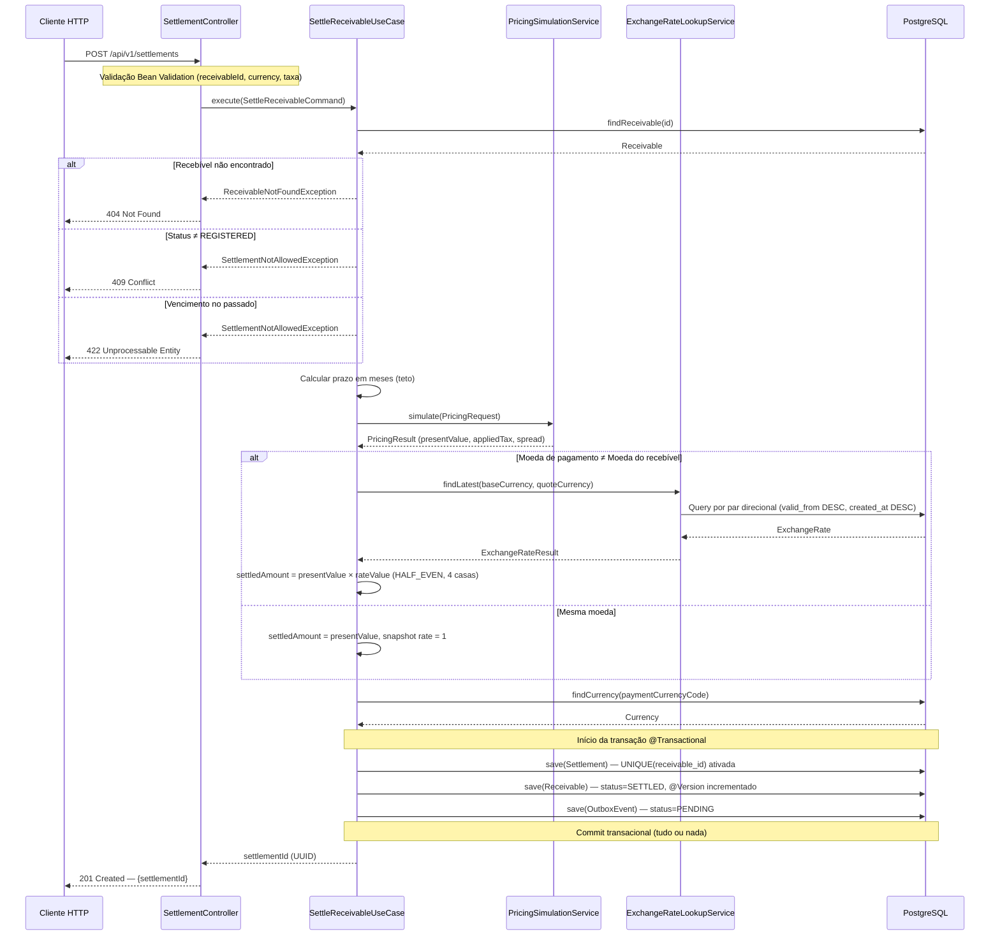

# Visão Geral da Arquitetura — SRM Credit Engine

## Decisão Arquitetural Principal: Modular Monolith em Camadas

O SRM Credit Engine foi construído como um **monólito modular** com separação clara de responsabilidades em camadas. Cada camada tem fronteiras explícitas e regras de dependência unidirecionais.

```
interfaces/rest   ─── DTOs, Controllers, Exception Handlers
application       ─── Use Cases, Commands, Application Services
domain            ─── Entities, Value Objects, Domain Services, Strategies
infrastructure    ─── JPA, JdbcTemplate, Config, Observability
reporting         ─── Queries analíticas com SQL nativo
```

## Por que não Microserviços

| Critério | Decisão | Justificativa |
|---|---|---|
| Escopo do desafio | Monólito modular | O desafio não exige serviços independentes implantáveis |
| Complexidade operacional | Monólito modular | Microserviços adicionariam service discovery, comunicação assíncrona e deploys distribuídos sem benefício real |
| Consistência transacional | Monólito modular | A liquidação envolve 3 operações atômicas (Settlement + Receivable + OutboxEvent) — em microserviços, isso exigiria sagas distribuídas ou 2PC |
| Prazo de desenvolvimento | Monólito modular | 7 dias não permitem operar microserviços com qualidade mínima |
| Fronteiras de domínio | Modular monolith | As fronteiras internas (pricing, currency, settlement, reporting) são claras e permitem extração futura se necessário |

## Responsabilidades por Camada

### `interfaces/rest`
Controllers HTTP, DTOs de entrada e saída, tratamento global de exceções (`@RestControllerAdvice`). Não contém regra de negócio. Traduz HTTP para comandos de aplicação.

### `application`
Casos de uso e serviços de aplicação. Orquestra o fluxo de negócio, gerencia transações (`@Transactional`) e delega para o domínio. Exemplos: `SettleReceivableUseCase`, `PricingSimulationService`, `RegisterExchangeRateUseCase`.

### `domain`
Entidades JPA, value objects, serviços de domínio e strategies de precificação. **Não depende de Spring nem de JPA diretamente** nas regras de negócio. O Strategy Pattern para precificação (`MercantileDuplicatePricingStrategy`, `PostDatedCheckPricingStrategy`) vive aqui.

### `infrastructure`
Repositórios JPA, configurações Spring (`@Configuration`), observabilidade (`BusinessMetrics`) e Flyway. Implementa as interfaces definidas pelo domínio e aplicação.

### `reporting`
Serviço e repositório de relatórios analíticos. Usa `NamedParameterJdbcTemplate` com SQL nativo otimizado (não JPA/JPQL) para suportar filtros dinâmicos com paginação eficiente.

## Trade-off: Consistência Agora vs Escala Futura

> A escolha por modular monolith prioriza consistência, simplicidade, rastreabilidade e menor custo operacional para o escopo do desafio. Para cenários de escala extrema, o projeto poderia evoluir para uma arquitetura orientada a eventos, com filas, workers assíncronos, CQRS, read replicas e particionamento.

O `outbox_events` já está preparado para receber um dispatcher assíncrono sem alterar o fluxo transacional principal.

## Decisões Técnicas Transversais

### Precisão Financeira
Todos os valores monetários, taxas e câmbio usam `BigDecimal`. Arredondamento explícito com `RoundingMode.HALF_EVEN` (arredondamento bancário). Nenhum `double` ou `float` em cálculos financeiros.

### Proteção contra Dupla Liquidação — 3 Barreiras
1. **Aplicação:** verificação de `receivable.status == REGISTERED` antes de iniciar a liquidação
2. **Banco:** `UNIQUE(receivable_id)` em `settlements` — falha com `DataIntegrityViolationException` em insert duplicado
3. **ORM:** `@Version` em `Receivable` — falha com `OptimisticLockException` em atualização concorrente

### Snapshot Cambial Imutável
A taxa de câmbio no momento da liquidação é persistida nas próprias colunas do `Settlement`. Isso garante auditoria futura sem recalcular taxas históricas.

### Strategy Pattern no Pricing Engine
`ReceivablePricingStrategyResolver` resolve a estratégia correta pelo código do tipo de recebível. Adicionar um novo tipo de recebível não exige modificar código existente — apenas criar uma nova implementação de `PricingStrategy`.

---

## Fluxo de Liquidação — Diagrama de Sequência



---

## Caminho de Evolução para Alta Escala

Para escala extrema (milhões de transações/minuto), o projeto poderia evoluir para:

| Componente Atual | Evolução Proposta |
|---|---|
| Monólito modular | Extração de serviços por domínio (pricing, settlement, reporting) |
| Processamento síncrono | Ingestão assíncrona via filas (Kafka/SQS) |
| Outbox sem dispatcher | Dispatcher com Debezium ou polling worker |
| CRUD transacional + relatório integrado | CQRS com write model e read model separados |
| PostgreSQL único | Read replicas para relatórios analíticos |
| Relatório via JdbcTemplate | Particionamento por data/cedente + índices especializados |
| Cache não implementado | Cache de taxas de câmbio (Redis) com TTL curto |
| Monitoramento básico | OpenTelemetry para tracing distribuído |

O `outbox_events` é o ponto de extensão central: um dispatcher real publicaria os eventos em um tópico Kafka, e outros serviços poderiam consumir `SettlementCreated` sem acoplar ao fluxo transacional.
