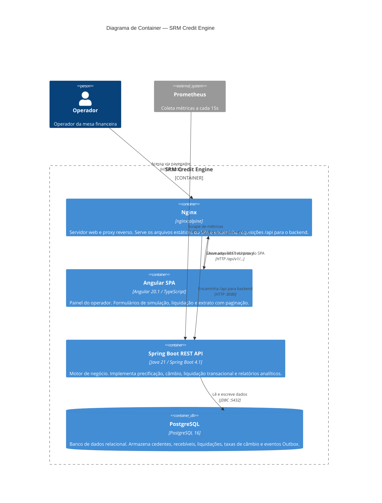

# C4 — Nível 2: Diagrama de Container

Visão dos containers que compõem o SRM Credit Engine e suas interações.



## Descrição dos Containers

### Nginx (porta 4200)

- Serve os arquivos estáticos gerados pelo build Angular (`dist/frontend/browser/`)
- Faz proxy reverso das requisições com path `/api` para o container `backend:8080`
- Configurado com `try_files $uri $uri/ /index.html` para suportar roteamento SPA
- Elimina a necessidade de CORS no backend em produção

### Angular SPA (buildado, servido pelo Nginx)

- Construído com Angular 20.1.0 usando componentes standalone
- Estado reativo com `signal()` e `computed()`
- Injeção de dependência com `inject()` (sem construtores)
- Formulários reativos com `ReactiveFormsModule` por componente
- 4 rotas com lazy loading: precificação, câmbio, liquidação, extrato
- Proxy de desenvolvimento (`proxy.conf.json`) encaminha `/api` para `localhost:8080`

### Spring Boot REST API (porta 8080)

- Expõe 5 endpoints REST versionados em `/api/v1`
- Documentação OpenAPI disponível em `/swagger-ui/index.html`
- Saúde em `/actuator/health` com probes de liveness e readiness
- Métricas em `/actuator/prometheus` (Micrometer + Prometheus registry)
- Executa migrations Flyway na inicialização
- Gerencia transações ACID via `@Transactional`
- Usa `NamedParameterJdbcTemplate` para queries analíticas de relatório

### PostgreSQL (porta 5432)

- Schema versionado e gerenciado pelo Flyway
- Credenciais injetadas via Docker Secrets (não variáveis de ambiente)
- 7 tabelas: `assignors`, `currencies`, `receivable_types`, `exchange_rates`, `receivables`, `settlements`, `outbox_events`
- Constraints financeiras, índices compostos e UNIQUE(receivable_id) para anti-dupla-liquidação

## Fluxo de Requisição — Exemplo

```
Operador → :4200/api/v1/settlements
→ Nginx (proxy /api → backend:8080)
→ Spring Boot SettlementController
→ SettleReceivableUseCase (@Transactional)
→ PricingSimulationService + ExchangeRateLookupService
→ PostgreSQL (save Settlement + update Receivable + save OutboxEvent)
→ 201 Created {settlementId}
```
