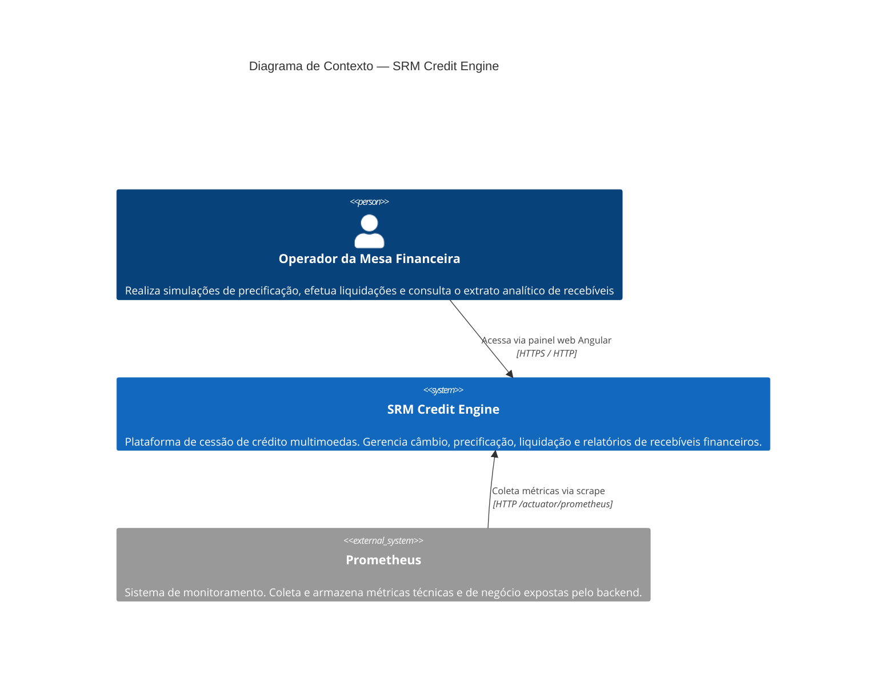

# C4 — Nível 1: Diagrama de Contexto

Visão de alto nível do SRM Credit Engine e suas relações com usuários e sistemas externos.

## Contexto do Sistema

### Quem usa

O **Operador da Mesa Financeira** é o único usuário do sistema nesta versão. Não há autenticação implementada — o acesso é aberto para fins de demonstração do desafio técnico.

### O que o sistema faz

O **SRM Credit Engine** é uma plataforma de cessão de crédito que permite:

1. **Gerenciar taxas de câmbio** — cadastrar e consultar taxas entre BRL e USD
2. **Simular precificação** — calcular o valor presente de um recebível com base em taxa, prazo e tipo
3. **Liquidar recebíveis** — registrar a liquidação de forma transacional, com snapshot cambial
4. **Consultar extrato analítico** — filtrar liquidações por período, cedente e moeda

### O que está fora do sistema

- Integração com APIs externas de câmbio (taxas registradas manualmente)
- Autenticação e autorização de usuários
- Sistemas ERP ou de origem dos recebíveis
- Dispatcher de eventos (Outbox implementado, dispatcher não)

### Monitoramento

O **Prometheus** é um sistema externo de monitoramento que faz scrape das métricas expostas pelo backend a cada 15 segundos. As métricas incluem contadores de negócio (simulações, liquidações, taxas registradas) e timers de latência.
