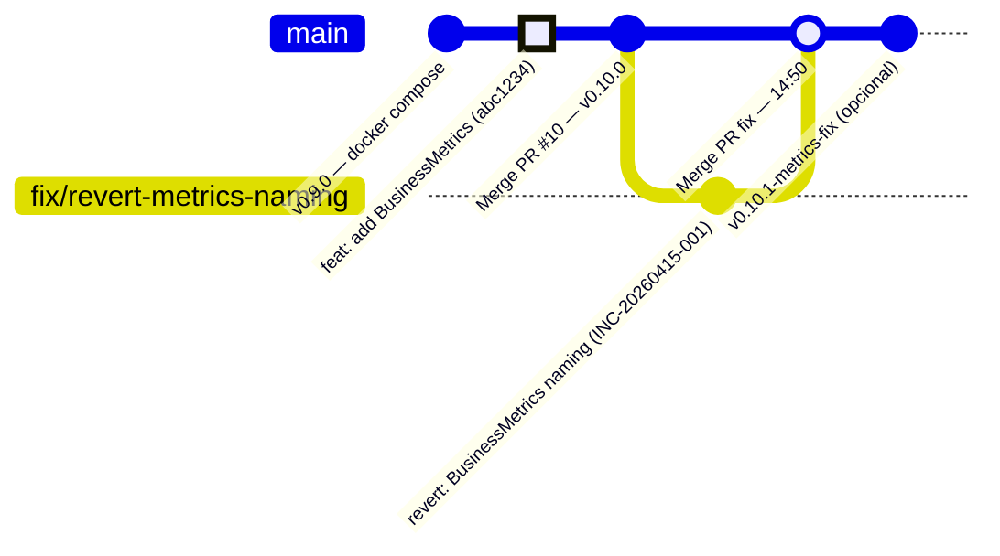

# Simulação de Git Revert — Incidente de Métrica Prometheus

> **SIMULAÇÃO DOCUMENTAL**
> Este documento descreve um incidente fictício e os comandos Git que seriam executados para resolvê-lo. Nenhum `git revert` foi executado neste repositório. Os hashes de commit são simbólicos. O objetivo é documentar o processo seguro de reversão de código sem reescrever histórico.

---

## Cenário do Incidente

**Incidente:** `[INC-20260415-001]`  
**Severidade:** SEV-3  
**Duração simulada:** 47 minutos (14:03 → 14:50)  
**Branch afetada:** `main` (após merge da v0.10.0)

### O que aconteceu

Após a release da milestone v0.10.0-backend-observability, o time de operações identificou que o counter de liquidações estava aparecendo como `settlements_total` no Prometheus, em vez do nome esperado `settlements_created_total`.

A causa raiz: o Prometheus Client 1.x (utilizado pelo Micrometer no Spring Boot 4.x) reserva o sufixo `_created` para timestamps de criação de counters no formato OpenMetrics. Assim, ao registrar o counter com ID `settlements.created.total`, o Prometheus remove o segmento `_created` e expõe a métrica como `settlements_total`.

Dashboards e alertas configurados com `settlements_created_total` pararam de funcionar silenciosamente — sem erro explícito, apenas dados ausentes.

> Para contexto completo sobre o comportamento do sufixo `_created`, consulte [`docs/observability/backend-observability.md`](../observability/backend-observability.md).

### Impacto

- Dashboards de operações com painel "Total de Liquidações" zerados
- Alerta `rate(settlements_created_total[5m]) > 0` nunca disparando
- Métrica acessível via `/actuator/metrics/settlements.created.total` (Micrometer correto), mas não via Prometheus no nome esperado
- **Sem perda de dados** — liquidações continuaram funcionando normalmente

---

## Identificação do Commit Problemático

O primeiro passo é identificar qual commit introduziu a mudança.

```bash
# Ver o log recente da main para identificar o commit suspeito
git log --oneline -10

# Saída esperada (exemplo):
# abc1234 feat(observability): add BusinessMetrics counters and timers
# def5678 build(observability): add micrometer-registry-prometheus dependency
# ghi9012 Merge pull request #10 from daniilooo/feature/backend-observability
# ...
```

```bash
# Inspecionar o commit em detalhe para confirmar a mudança
git show abc1234
```

```bash
# Ver os arquivos modificados por esse commit
git show abc1234 --name-only
```

> **`abc1234`** é um hash simbólico usado neste exemplo. Em um incidente real, use o hash completo do commit problemático obtido via `git log`.

### Confirmar que o commit é revertível de forma isolada

Antes de reverter, verificar se o commit depende de mudanças anteriores ou se mudanças posteriores dependem dele:

```bash
# Ver commits que tocaram os mesmos arquivos após abc1234
git log abc1234..HEAD -- backend/src/main/java/br/com/srm/creditengine/infrastructure/observability/BusinessMetrics.java
```

Se não houver dependências, o revert é seguro. Se houver, avaliar hotfix em vez de revert.

---

## Por que `git revert` e Não `git reset --hard`

| Abordagem | O que faz | Quando usar |
|---|---|---|
| `git revert <hash>` | Cria **novo commit** que desfaz as mudanças do commit indicado. Histórico preservado. | Branch compartilhada, produção, qualquer situação onde outros possam ter baseado trabalho no commit |
| `git reset --hard <hash>` | Move o ponteiro HEAD para um commit anterior, **descartando** todos os commits posteriores do histórico local | **Apenas** branches locais ainda não compartilhadas. **Nunca em main ou branches compartilhadas** |
| `git push --force` | Reescreve o histórico remoto | **Nunca em main**. Em branches de feature apenas com consenso do time |

**Razão prática:** se o commit `abc1234` já foi mergeado em `main` e outros colaboradores já fizeram `git pull`, um `reset --hard` seguido de force push quebraria o repositório local desses colaboradores — eles teriam divergência de histórico e precisariam de intervenção manual.

O `git revert` é **sempre seguro em branch compartilhada** porque apenas adiciona um commit novo.

---

## Fluxo Seguro de Revert

### Passo 1 — Criar branch de correção

```bash
# Garantir que está na main atualizada
git checkout main
git pull origin main

# Criar branch de correção a partir da main
git checkout -b fix/revert-metrics-naming
```

### Passo 2 — Executar o revert

```bash
# Reverter o commit problemático
# -n (--no-commit): aplica as mudanças sem criar o commit ainda
# Isso permite revisar as mudanças antes de commitar
git revert abc1234 --no-commit

# Verificar as mudanças que serão desfeitas
git diff --staged

# Se tudo estiver correto, criar o commit de revert
git commit -m "revert(observability): revert BusinessMetrics counter naming

Reverts commit abc1234.

Reason: counter 'settlements.created.total' is rendered as 'settlements_total'
in Prometheus due to OpenMetrics reserved '_created' suffix. This breaks
dashboards and alerts configured with 'settlements_created_total'.

A proper fix with renamed metrics will follow in a dedicated PR.

Ref: INC-20260415-001"
```

> **Por que `-n` (--no-commit)?** Permite revisar as mudanças antes de commitar. Em uma crise, é fácil reverter o commit errado ou introduzir um conflito. A inspeção prévia é uma salvaguarda.

### Passo 3 — Validar localmente

```bash
# Rodar o build completo
cd backend
./mvnw clean verify

# Confirmar que os testes passam
# Confirmar que a cobertura JaCoCo ≥ 90% se mantém
```

```bash
# Subir o backend localmente (com Docker para o banco)
docker compose up -d postgres
./mvnw spring-boot:run

# Em outro terminal, verificar o estado das métricas
curl http://localhost:8080/actuator/metrics | jq '.names[] | select(contains("settlement"))'
```

### Passo 4 — Abrir PR

```bash
# Publicar a branch de correção
git push origin fix/revert-metrics-naming
```

Criar PR com título: `revert(observability): revert BusinessMetrics counter naming [INC-20260415-001]`

**Critérios de revisão acelerada em incidente:**
- Review mínimo de 1 aprovador (não do autor do commit revertido)
- CI/CD deve passar (build + testes + cobertura)
- Verificar que o revert não quebra funcionalidade existente

### Passo 5 — Merge e Validação em Produção

Após merge na main:

```bash
# Validar no ambiente de produção
curl https://api.producao/actuator/health
curl https://api.producao/actuator/prometheus | grep "settlements"

# Confirmar que dashboards voltaram ao normal
# Confirmar que alertas voltaram a disparar corretamente
```

### Passo 6 — Tag (opcional)

Se o incidente justificar um identificador de release para rastreabilidade:

```bash
# Exemplo opcional — somente após confirmação humana
git checkout main
git pull origin main
git tag -a v0.10.1-metrics-fix -m "Revert BusinessMetrics counter naming (INC-20260415-001)"
git push origin v0.10.1-metrics-fix
```

> A tag de patch é **opcional** neste cenário (SEV-3 sem impacto em dados). Para SEV-1, uma tag de hotfix é fortemente recomendada para rastreabilidade de qual versão está em produção.

---

## Timeline do Incidente



### Linha do tempo do incidente

```mermaid
timeline
    title INC-20260415-001 — Métrica Prometheus com nome inesperado
    14:03 : Alerta: painel "Liquidações" zerado no dashboard
          : Incident Commander designado
    14:10 : SEV-3 classificado — sem perda de dados
          : Causa raiz identificada no log do Prometheus
    14:18 : Decisão: git revert do commit abc1234
          : Branch fix/revert-metrics-naming criada
    14:25 : git revert abc1234 executado e validado localmente
          : ./mvnw clean verify passando
    14:32 : PR aberto e em revisão
    14:41 : PR aprovado e mergeado na main
    14:50 : Deploy realizado — dashboards normalizados
          : Incidente encerrado
```

---

## Riscos do Revert

| Risco | Como mitigar |
|---|---|
| Revert do commit errado | Usar `git show <hash>` para confirmar o conteúdo antes de reverter |
| Conflito com mudanças posteriores | Verificar com `git log <hash>..HEAD -- <arquivo>` antes de reverter |
| Revert quebra outros testes | Sempre rodar `./mvnw clean verify` antes de abrir o PR |
| Revert reverte mais do que o esperado | Usar `--no-commit` para inspecionar as mudanças antes de confirmar |
| Confundir branch de revert com branch de hotfix | Usar prefixo `fix/revert-*` para reverts e `hotfix/*` para correções novas |

---

## O Que Fazer Depois do Revert

Um revert é uma **contenção**, não uma solução definitiva. Após o incidente:

1. Abrir issue ou card de backlog com a correção definitiva
2. Discutir a renomeação do counter (ex: `settlements.completed.total` em vez de `settlements.created.total`)
3. Atualizar dashboards e alertas com o novo nome
4. Documentar a decisão final no ADR correspondente
5. Conduzir o postmortem em até 48h

> A solução definitiva para este incidente está documentada em [`docs/observability/backend-observability.md`](../observability/backend-observability.md) — o nome `settlements.created.total` foi mantido no Micrometer (ID interno correto), mas a exposição Prometheus como `settlements_total` foi documentada como comportamento esperado do OpenMetrics, não como bug.
