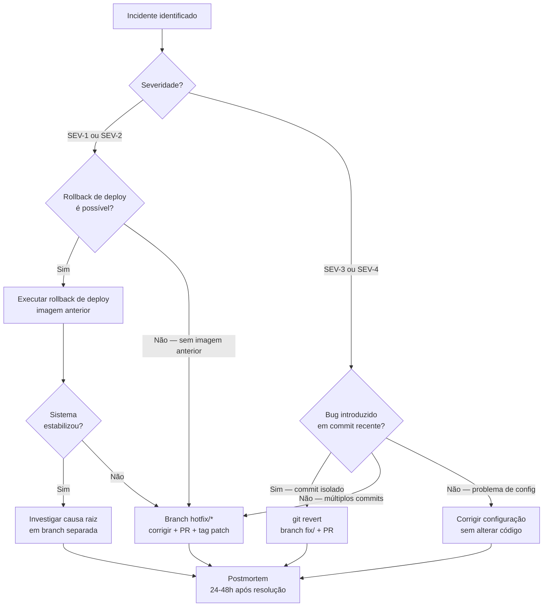

# Incident Response Playbook — SRM Credit Engine

## Objetivo

Padronizar a resposta a incidentes em produção para minimizar o tempo entre detecção, contenção e recuperação. Este playbook define papéis, critérios de severidade, fluxo de decisão e checklist de encerramento.

O objetivo não é improvisar — é seguir um processo conhecido antes do incidente acontecer.

---

## Severidades

| Nível | Nome | Critério | Exemplo | RTO alvo |
|---|---|---|---|---|
| **SEV-1** | Crítico | Sistema fora, pagamentos afetados, dados perdidos ou expostos | Backend indisponível, dupla liquidação ocorrida, secret exposto | < 15 min |
| **SEV-2** | Alto | Funcionalidade principal degradada sem perda de dados | Liquidação retornando erro para 100% dos requests, observabilidade cega | < 1 hora |
| **SEV-3** | Médio | Degradação parcial ou observabilidade comprometida | Métrica com nome errado quebrando dashboards, relatório lento | < 4 horas |
| **SEV-4** | Baixo | Problema cosmético, funcionalidade secundária | Link quebrado na documentação, UI com texto incorreto | Próxima release |

**RTO (Recovery Time Objective):** tempo máximo aceitável para restaurar o serviço.  
**RPO (Recovery Point Objective):** quantidade máxima de dados que pode ser perdida. No SRM Credit Engine, o RPO é **zero** — nenhuma liquidação pode ser perdida.

---

## Papéis e Responsabilidades

| Papel | Responsabilidade durante incidente |
|---|---|
| **Incident Commander** | Coordena a resposta, toma decisões de escalonamento, comunica status |
| **Tech Lead / Backend** | Investiga causa raiz, executa revert ou hotfix, valida correção |
| **DevOps / SRE** | Monitora infraestrutura, executa rollback de deploy se necessário, verifica logs |
| **QA** | Valida correção em ambiente de staging, executa checklist de regressão |
| **Comunicação** | Atualiza stakeholders internos e, se necessário, clientes afetados |

> Em times pequenos, uma pessoa pode acumular papéis. O essencial é que alguém assuma o papel de **Incident Commander** — uma única voz coordenando a resposta.

---

## Triagem — Perguntas de Diagnóstico Rápido

Ao detectar um possível incidente, responder imediatamente:

```
1. O que está falhando? (sistema, funcionalidade, métrica)
2. Desde quando? (primeira evidência nos logs ou alertas)
3. Quantos usuários/operações afetados?
4. Há perda de dados ou risco financeiro?
5. O incidente está ativo ou foi resolvido automaticamente?
6. Qual foi a última mudança deployada antes do incidente?
```

Com base nessas respostas, classificar a severidade e acionar os papéis correspondentes.

---

## Comunicação

### Canal de incidente

Criar thread dedicada no canal de comunicação da equipe com:
- Título: `[INC-YYYYMMDD-N] SEV-X: <descrição curta>`
- Atualização a cada 15 minutos enquanto o incidente estiver ativo
- Encerramento com resumo ao fechar

### Template de atualização de status

```
[INC-YYYYMMDD-N] Atualização HH:MM

Status: Investigando / Contendo / Corrigindo / Resolvido
Impacto atual: <descrição>
Última ação: <o que foi feito>
Próxima ação: <o que será feito>
ETA de resolução: <estimativa ou "indefinido">
```

### Comunicação externa

Para incidentes SEV-1 ou SEV-2 com impacto em clientes:
- Informar ao cliente dentro do RTO alvo
- Não especular causa raiz antes de confirmar
- Comunicar resolução ao encerrar

---

## Contenção

A contenção é a ação imediata para **parar o sangramento** — não necessariamente resolver a causa raiz.

| Tipo de incidente | Ação de contenção |
|---|---|
| Backend retornando erro 5xx | Rollback de deploy para a imagem anterior |
| Migration Flyway falhou | Reverter migration manualmente + rollback de deploy |
| Secret não configurado | Configurar secret + redeploy (sem commit de secret) |
| Métrica com nome errado | Documentar + monitorar manualmente enquanto corrige |
| Frontend apontando para URL incorreta | Rollback de deploy do frontend |

> **Rollback de deploy** (reimplantar a imagem anterior) é quase sempre mais rápido que esperar um revert de código ser mergeado. Use-o como primeira linha de contenção para SEV-1 e SEV-2.

---

## Decisão: Rollback de Deploy, Git Revert ou Hotfix?



### Quando usar cada estratégia

| Estratégia | Quando usar | O que faz |
|---|---|---|
| **Rollback de deploy** | Bug em produção, imagem anterior disponível | Reimplanta a versão anterior — mais rápido |
| **`git revert`** | Commit problemático identificado, branch compartilhada | Cria novo commit que desfaz o anterior — histórico preservado |
| **Hotfix** | Correção necessária sem reverter tudo | Branch `hotfix/*` a partir de main, corrige e mergeia |
| **Cherry-pick** | Um commit bom está num branch ainda não mergeado | Copia o commit para main sem mergeá-lo tudo |

> **Nunca use `git reset --hard` em branches compartilhadas** — destrói o histórico e quebra o repositório para todos os colaboradores.  
> **Nunca use force push em main** — mesmo argumento, com consequências maiores.

---

## Validação Pós-Correção

Antes de declarar o incidente resolvido, confirmar:

- [ ] Sistema respondendo normalmente (`curl /actuator/health`)
- [ ] Métricas voltando ao padrão esperado no Prometheus
- [ ] Logs sem erros inesperados por pelo menos 5 minutos
- [ ] Operação afetada testada manualmente pelo QA
- [ ] Nenhum efeito colateral identificado em outras funcionalidades
- [ ] Time notificado que o incidente foi resolvido

---

## Postmortem

Para todo incidente SEV-1 ou SEV-2, postmortem é **obrigatório**.  
Para SEV-3, é recomendado.  
Para SEV-4, é opcional.

**Prazo:** 24 a 48 horas após a resolução.  
**Owner:** Incident Commander.  
**Template:** `docs/crisis-management/postmortem-template.md`

O postmortem não é para punir — é para entender o que aconteceu, por que aconteceu, e como evitar que aconteça de novo.

---

## Checklist Completo de Resposta a Incidentes

### Detecção e triagem
- [ ] Incidente detectado (alerta, usuário, monitoramento)
- [ ] Severidade classificada (SEV-1 a SEV-4)
- [ ] Incident Commander designado
- [ ] Thread de incidente criada com título padronizado

### Contenção
- [ ] Impacto mapeado (o que está afetado, quantos usuários)
- [ ] Última mudança deployada identificada
- [ ] Decisão de contenção tomada (rollback / revert / hotfix / config)
- [ ] Contenção executada
- [ ] Primeira atualização de status enviada

### Investigação
- [ ] Causa raiz identificada (ou hipótese principal)
- [ ] Commit ou configuração problemática identificada
- [ ] Solução definitiva planejada

### Correção
- [ ] Correção implementada (revert, hotfix ou config)
- [ ] Testes locais passando
- [ ] PR aberto e revisado
- [ ] Merge realizado
- [ ] Deploy da correção realizado

### Validação
- [ ] Sistema respondendo normalmente
- [ ] Métricas normalizadas
- [ ] QA validou operação afetada
- [ ] Nenhum efeito colateral identificado

### Encerramento
- [ ] Incidente declarado resolvido
- [ ] Equipe notificada
- [ ] Clientes comunicados (se aplicável)
- [ ] Postmortem agendado (se SEV-1 ou SEV-2)
- [ ] Thread de incidente encerrada com resumo
