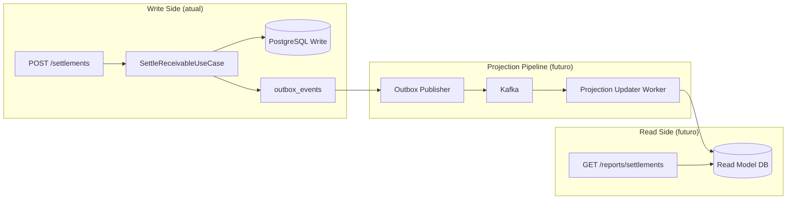

# Evolução do Reporting — CQRS e Read Model

> **Proposta futura — não implementado nesta versão.**
> O reporting atual usa SQL nativo com `NamedParameterJdbcTemplate` diretamente no banco transacional. Este documento descreve a evolução proposta para um modelo CQRS com read model dedicado, projeções atualizadas por eventos e read replicas para escala analítica.

---

## Reporting Atual — SQL Nativo no Banco Transacional

### O que está implementado

A camada `reporting` do projeto já está separada das demais camadas — isso é a semente do CQRS:

```
interfaces/rest
  → SettlementReportController
      → SettlementReportService (reporting layer)
          → SettlementReportRepository
              → NamedParameterJdbcTemplate (SQL nativo)
                  → PostgreSQL (banco transacional)
```

### Query atual (SQL nativo)

O `SettlementReportRepository` executa SQL com filtros dinâmicos:

```sql
SELECT
    s.id              AS settlement_id,
    r.external_reference,
    a.trade_name      AS assignor_name,
    r.face_value,
    s.settled_amount,
    pc.code           AS payment_currency,
    s.exchange_rate_value,
    s.created_at      AS settled_at
FROM settlements s
JOIN receivables r    ON r.id = s.receivable_id
JOIN assignors a      ON a.id = s.assignor_id
JOIN currencies pc    ON pc.id = s.payment_currency_id
WHERE (:assignorId IS NULL OR s.assignor_id = :assignorId)
  AND (:from IS NULL OR s.created_at >= :from)
  AND (:to IS NULL OR s.created_at <= :to)
  AND (:paymentCurrencyCode IS NULL OR pc.code = :paymentCurrencyCode)
ORDER BY s.created_at DESC
LIMIT :pageSize OFFSET :offset;
```

### Limitações em alto volume

| Limitação | Impacto |
|---|---|
| Query no banco transacional (write side) | Queries analíticas competem com escritas pelas mesmas conexões |
| JOINs de múltiplas tabelas | Aumentam com o volume de dados; sem índice específico por filtro, podem ser lentos |
| `OFFSET` pagination em tabelas grandes | `OFFSET 100000` é lento — PostgreSQL precisa ler e descartar todas as linhas anteriores |
| Sem cache de resultado | Mesma query executada N vezes por N usuários |

---

## Por Que Separar Leitura no Futuro

Em alto volume, o banco transacional (write side) é um recurso crítico. Relatórios analíticos não devem competir com liquidações por conexões e locks.

**Princípio do CQRS:** separar o modelo de escrita do modelo de leitura permite otimizar cada um de forma independente.

| Aspecto | Write Side (atual) | Read Side (proposta futura) |
|---|---|---|
| Banco | PostgreSQL normalizado | Read model desnormalizado ou read replica |
| Operações | INSERT, UPDATE (transacionais) | SELECT (analítico) |
| Consistência | Forte (ACID) | Eventual (lag aceitável) |
| Escala | Vertical (mais CPU/RAM) | Horizontal (mais read replicas) |
| Schema | Normalizado (3NF) | Desnormalizado (flat, otimizado para query) |

---

## Modelo CQRS Proposto

> Design evolutivo. Não implementado.



---

## Projections

Uma **projection** é uma visão materializada dos dados, otimizada para leitura. Ela é criada e mantida por um worker que consome eventos do broker.

### Exemplo — Projection de Extrato de Liquidações

Quando o evento `SettlementCompleted` é recebido, o Projection Updater insere ou atualiza a projeção:

```sql
-- Read model — tabela desnormalizada (proposta futura)
CREATE TABLE settlement_report_projection (
    settlement_id          UUID PRIMARY KEY,
    external_reference     VARCHAR(255),
    assignor_name          VARCHAR(255),
    assignor_id            UUID,
    face_value             NUMERIC(19,4),
    settled_amount         NUMERIC(19,4),
    payment_currency_code  VARCHAR(10),
    exchange_rate_value    NUMERIC(19,10),
    settled_at             TIMESTAMPTZ,
    -- Campos derivados pré-calculados
    settlement_month       VARCHAR(7),  -- '2026-06'
    settlement_year        INTEGER      -- 2026
);
```

**Vantagem:** sem JOINs. A query de relatório seria:

```sql
SELECT * FROM settlement_report_projection
WHERE assignor_id = :assignorId
  AND settled_at BETWEEN :from AND :to
  AND payment_currency_code = :currency
ORDER BY settled_at DESC;
```

---

## Read Model

O read model é o banco (ou schema) exclusivo para leitura. Pode ser:

| Opção | Quando usar |
|---|---|
| **Mesmo PostgreSQL, schema diferente** (`reporting.*`) | Volume baixo a médio; sem separação de infra |
| **Read Replica do PostgreSQL** | Volume médio; sem novo banco; lag de replicação aceitável |
| **PostgreSQL separado** com projeções | Volume alto; time dedicado ao reporting |
| **Elasticsearch** | Busca full-text e agregações complexas |
| **ClickHouse / DuckDB** | Analytics OLAP de alto volume |

Para o SRM Credit Engine, a evolução natural seria:

1. **Fase 1:** read replica do PostgreSQL (já separa leitura da escrita sem novo schema)
2. **Fase 2:** projection em schema separado no mesmo banco (mais controle)
3. **Fase 3:** banco dedicado para reporting se o volume justificar

---

## Read Replicas

> Proposta futura. Requer configuração de streaming replication no PostgreSQL.

```
PostgreSQL Primary (writes)
  ↓ streaming replication (WAL)
PostgreSQL Replica 1 → SettlementReportService aponta aqui
PostgreSQL Replica 2 → Dashboards e BI apontam aqui
```

**Como configurar no Spring Boot:**

```yaml
# application.yaml (proposta futura)
spring:
  datasource:
    primary:
      url: jdbc:postgresql://primary:5432/srm_credit_engine
    reporting:
      url: jdbc:postgresql://replica:5432/srm_credit_engine
```

O `SettlementReportService` usaria o `DataSource` de leitura; os use cases transacionais usariam o primário.

---

## Consistência Eventual

Ao usar read replicas ou projeções atualizadas por eventos, existe um **lag** entre a escrita e a leitura.

**Lag esperado:**

| Abordagem | Lag típico |
|---|---|
| Read replica (streaming replication) | < 100ms em rede local |
| Projection via Outbox + Kafka | 1–5s (poll interval do consumer) |
| Projection via CDC (Debezium) | < 500ms |

**Para o usuário do painel Angular:**

- Após liquidar, aguardar ~5s e recarregar o extrato é aceitável
- Para operações críticas de auditoria, o endpoint transacional (`GET /settlements/{id}`) deve consultar o banco primário
- Expor header `X-Report-Generated-At` para indicar a data de atualização dos dados

---

## Paginação em Alto Volume

O `OFFSET` é inadequado para tabelas com milhões de registros. Proposta futura: **cursor-based pagination**.

### Paginação atual (OFFSET — implementada)

```
GET /reports/settlements?page=0&size=50
GET /reports/settlements?page=1000&size=50  → lento com 50.000+ registros
```

### Cursor-based pagination (proposta futura)

```
GET /reports/settlements?size=50
→ Resposta: { data: [...], nextCursor: "2026-05-01T14:00:00Z_uuid-abc" }

GET /reports/settlements?cursor=2026-05-01T14:00:00Z_uuid-abc&size=50
→ Query: WHERE (settled_at, id) < (:cursorDate, :cursorId) ORDER BY settled_at DESC, id DESC
```

**Vantagem:** performance constante independente da página. `WHERE (col1, col2) < (val1, val2)` usa índice composto.

---

## Filtros em Alto Volume

No read model, índices podem ser criados especificamente para os padrões de query mais comuns:

```sql
-- Índice composto por cedente + data (filtro mais comum)
CREATE INDEX idx_srp_assignor_settled_at
    ON settlement_report_projection (assignor_id, settled_at DESC);

-- Índice por moeda + data
CREATE INDEX idx_srp_currency_settled_at
    ON settlement_report_projection (payment_currency_code, settled_at DESC);

-- Índice para cursor-based pagination
CREATE INDEX idx_srp_cursor
    ON settlement_report_projection (settled_at DESC, settlement_id DESC);
```

---

## Trade-offs

| Aspecto | SQL Nativo Atual | CQRS + Read Model (futuro) |
|---|---|---|
| Complexidade de código | Baixa | Alta (projection updater, sync, lag) |
| Performance em alto volume | Degradada (JOINs, OFFSET, shared DB) | Alta (desnormalizado, índices dedicados) |
| Consistência | Forte (tempo real) | Eventual (lag aceitável) |
| Custo de infra | Baixo | Alto (mais bancos, mais processos) |
| Debug de inconsistências | Não existe | Exige comparação write/read |
| Facilidade de evolução | Baixa (JOINs fixos) | Alta (projeções independentes) |

> **Recomendação:** manter o SQL nativo atual enquanto o volume não justificar a complexidade do CQRS. A separação em camada `reporting` já é a preparação correta — a migração futura exigirá mudar apenas a fonte de dados dessa camada, sem alterar o domínio.
