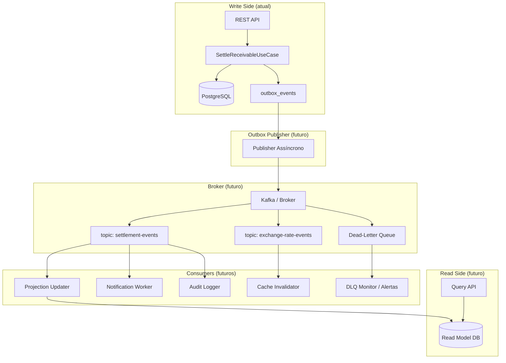

# Evolução para Event-Driven Architecture

> **Proposta futura — não implementado nesta versão.**
> Este documento descreve como o SRM Credit Engine evoluiria de um monólito modular síncrono para uma arquitetura orientada a eventos (Event-Driven Architecture). Nenhum broker, consumer, producer ou worker foi implementado. O ponto de extensão central é a tabela `outbox_events`, já presente no schema.

---

## Estado Atual — Monólito Modular Síncrono

O sistema atual funciona assim:

```
Cliente HTTP
  → REST Controller
  → Application UseCase (@Transactional)
  → Domain (Strategy, Validations)
  → JPA Repository (PostgreSQL)
  → OutboxEvent (mesma transação — persistido, não publicado)
  → Response HTTP
```

**O que funciona bem hoje:**
- Consistência transacional ACID em todas as operações
- Simplicidade operacional — um único processo, um banco de dados
- Debug fácil — rastreamento direto via logs e IDs
- Zero latência entre escrita e leitura no mesmo processo

**Limitação:** tudo é síncrono. O cliente aguarda a liquidação completa antes de receber resposta.

---

## Por que Não Começar com Microserviços

| Critério | Monólito Modular | Microserviços |
|---|---|---|
| Consistência transacional | ACID — uma transação | Requer saga distribuída |
| Complexidade operacional | 1 processo, 1 banco | N serviços, N bancos, broker, service mesh |
| Deploy | 1 artefato | N pipelines independentes |
| Debug | Stack trace linear | Tracing distribuído obrigatório |
| Custo de infra | Baixo | Alto |
| Adequação ao escopo | Alta — escopo é conhecido e delimitado | Baixa — over-engineering para este nível |

> A separação em camadas (`domain`, `application`, `infrastructure`, `interfaces/rest`, `reporting`) já garante que o domínio não está acoplado ao framework. **Isso é o que importa para evoluir** — não o deploy em processos separados.

---

## Quando Evoluir para EDA

Critérios objetivos que justificariam a migração:

| Critério | Threshold |
|---|---|
| Volume de transações | > 100.000 liquidações/hora de forma sustentada |
| Latência inaceitável | P99 de liquidação > 2s com otimizações esgotadas |
| Necessidade de desacoplamento de times | Mais de 2 times trabalhando no mesmo domínio |
| Necessidade de auditoria em tempo real | Consumidores externos precisam de eventos imediatos |
| Resiliência a falhas de dependências | Downstream pode ficar indisponível por minutos |

---

## Eventos de Domínio Candidatos

Estes são os eventos que o sistema emitiria em uma arquitetura EDA. **Não implementados.**

| Evento | Emitido por | Payload principal |
|---|---|---|
| `ReceivableRegistered` | (futuro) RegisterReceivableUseCase | receivableId, assignorId, faceValue, dueDate, type |
| `ExchangeRateRegistered` | RegisterExchangeRateUseCase | baseCurrency, quoteCurrency, rateValue, validFrom |
| `SettlementRequested` | (futuro) ingestão assíncrona | settlementRequestId, receivableId, paymentCurrencyCode |
| `SettlementCompleted` | SettleReceivableUseCase | settlementId, receivableId, settledAmount, exchangeRateValue |
| `SettlementFailed` | SettleReceivableUseCase | settlementRequestId, receivableId, reason, attempts |
| `ReportRequested` | (futuro) relatórios assíncronos | reportId, filters, requestedBy |

### Estrutura mínima de um evento de domínio

```json
{
  "eventId": "uuid",
  "eventType": "SettlementCompleted",
  "aggregateType": "Settlement",
  "aggregateId": "uuid",
  "occurredAt": "2026-06-22T14:00:00Z",
  "correlationId": "uuid",
  "version": "1",
  "payload": {
    "settlementId": "uuid",
    "receivableId": "uuid",
    "settledAmount": "1523.47",
    "paymentCurrencyCode": "USD",
    "exchangeRateValue": "5.2134567890"
  }
}
```

---

## Produtores e Consumidores Futuros

### Produtores (Producers)

| Componente | Evento produzido |
|---|---|
| `SettleReceivableUseCase` (hoje: grava outbox) | `SettlementCompleted`, `SettlementFailed` |
| `RegisterExchangeRateUseCase` (hoje: grava outbox) | `ExchangeRateRegistered` |
| (futuro) `RegisterReceivableUseCase` | `ReceivableRegistered` |
| (futuro) Publisher do Outbox | Lê `outbox_events`, publica no broker |

### Consumidores (Consumers)

| Consumer | Evento consumido | O que faz |
|---|---|---|
| Projection Updater | `SettlementCompleted` | Atualiza read model para relatórios |
| Cache Invalidator | `ExchangeRateRegistered` | Invalida cache de FX rates |
| Audit Logger | Todos | Registra eventos em log de auditoria |
| Notification Worker | `SettlementCompleted`, `SettlementFailed` | Envia notificação ao cedente |
| DLQ Monitor | Todos (via DLQ) | Alerta quando eventos estão na fila morta |

---

## Diagrama — Fluxo EDA Futuro



---

## Consistência Eventual

Em uma arquitetura EDA, a consistência entre o write side e o read side é **eventual**, não imediata.

**Implicações práticas:**

- Um settlement criado agora pode não aparecer nos relatórios por alguns milissegundos (ou segundos, dependendo do lag do consumer)
- O cliente deve ser informado sobre esse comportamento — por exemplo, com um header `X-Data-Freshness: 2026-06-22T14:00:00Z`
- Relatórios críticos (ex: posição exata de liquidação em tempo real) devem continuar usando o banco transacional

**Aceitabilidade:** para o domínio de relatórios analíticos (extrato de liquidações do dia), um lag de até 5 segundos é aceitável. Para relatórios de auditoria regulatória, pode ser necessária consistência forte.

---

## Idempotência

Todo consumer deve ser **idempotente**: processar o mesmo evento mais de uma vez não pode alterar o resultado.

**Estratégia:**

```
Consumer recebe evento com eventId "abc-123"
  → Verifica se "abc-123" já foi processado (tabela de processed_events ou campo na projeção)
  → Se sim: descarta (ack sem reprocessar)
  → Se não: processa + registra "abc-123" como processado
```

O campo `correlation_id` na `outbox_events` serve como base para essa deduplicação.

---

## Versionamento de Eventos

Eventos mudam ao longo do tempo. Para compatibilidade:

| Estratégia | Quando usar |
|---|---|
| **Backward compatible** (adicionar campos opcionais) | Mudanças não-breaking — consumidores antigos ignoram campos novos |
| **Versionamento explícito** (`"version": "2"`) | Mudanças breaking — consumers precisam suportar v1 e v2 em paralelo |
| **Schema Registry** (Confluent, AWS Glue) | Em produção com múltiplos consumers e alta taxa de mudança |

> Para o escopo atual: campo `version` no payload é suficiente. Schema Registry é evolução futura.

---

## Dead-Letter Queue (DLQ)

Quando um consumer falha após N tentativas, o evento deve ir para a DLQ em vez de bloquear o tópico principal.

**Fluxo:**

```
Evento → Consumer → Falha
  → Retry 1 (1s delay)
  → Retry 2 (2s delay)
  → Retry 3 (4s delay)
  → DLQ (alerta + intervenção manual ou worker de compensação)
```

**Campos que devem acompanhar o evento na DLQ:**
- `originalTopic`
- `originalPartition`
- `originalOffset`
- `failureReason`
- `failedAt`
- `attempts`

---

## Observabilidade do Fluxo EDA

| Métrica | Descrição |
|---|---|
| `kafka.consumer.lag` | Quantos eventos ainda não foram processados por consumer group |
| `dlq.depth` | Número de mensagens na fila morta |
| `event.processing.duration` | Latência de processamento por tipo de evento |
| `event.retry.count` | Número de retentativas por consumer |
| `outbox.pending.count` | Eventos pendentes de publicação na `outbox_events` |

---

## Trade-offs

| Aspecto | Hoje (síncrono) | Futuro (EDA) |
|---|---|---|
| Consistência | Forte (ACID) | Eventual |
| Latência do cliente | Alta (aguarda tudo) | Baixa (aceita e processa) |
| Resiliência | Baixa (falha = timeout) | Alta (retry, DLQ) |
| Complexidade | Baixa | Alta |
| Debug | Fácil (logs lineares) | Difícil (requer tracing distribuído) |
| Custo operacional | Baixo | Alto (broker, consumers, DLQ, monitoring) |
| Throughput | Limitado ao sync | Alto (N consumers em paralelo) |

> **Recomendação:** migrar para EDA **por fase e por necessidade**, não antecipadamente. A tabela `outbox_events` garante que a transição pode ser feita sem alterar o domínio.
