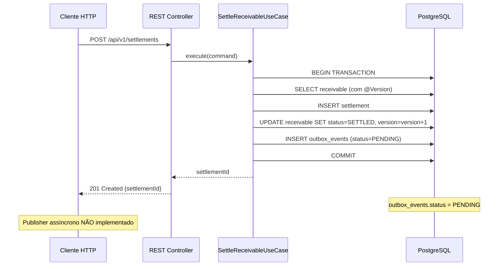
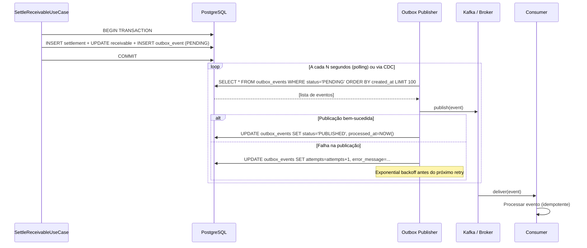

# Evolução do Outbox Pattern

> **Proposta futura (publisher) — parcialmente implementado.**
> A tabela `outbox_events` **está implementada** e é persistida na mesma transação da liquidação. O **publisher assíncrono** (componente responsável por ler a `outbox_events` e publicar no broker) **não foi implementado nesta versão**. Este documento descreve o estado atual e o design evolutivo completo.

---

## O Que Está Implementado Hoje

### Tabela `outbox_events`

Criada na migration `V1__create_initial_schema.sql` junto com as demais tabelas do schema financeiro.

| Campo | Tipo | Descrição |
|---|---|---|
| `id` | `UUID` | Identificador único do evento |
| `aggregate_type` | `VARCHAR` | Tipo do agregado raiz (ex: `Settlement`) |
| `aggregate_id` | `UUID` | UUID do agregado que gerou o evento |
| `event_type` | `VARCHAR` | Tipo do evento (ex: `SettlementCompleted`) |
| `payload` | `JSONB` | Conteúdo do evento em JSON |
| `status` | `VARCHAR` | `PENDING`, `PUBLISHED`, `FAILED` |
| `correlation_id` | `VARCHAR` | Identificador de correlação para rastreamento |
| `attempts` | `INTEGER` | Número de tentativas de publicação |
| `error_message` | `VARCHAR` | Mensagem de erro da última falha |
| `created_at` | `TIMESTAMPTZ` | Momento de criação do evento |
| `processed_at` | `TIMESTAMPTZ` | Momento em que foi publicado com sucesso |

### Onde é populada hoje

Em `SettleReceivableUseCase`, na **mesma transação** que cria o `Settlement` e atualiza o `Receivable`:

```java
// Dentro do @Transactional
Settlement saved = settlementRepository.save(settlement);
receivable.markAsSettled();
receivableRepository.save(receivable);

// OutboxEvent criado e salvo na MESMA transação
OutboxEvent event = OutboxEvent.forSettlement(saved);
outboxEventRepository.save(event);
```

**Garantia:** se a transação for revertida (ex: `OptimisticLockException`), o evento também é descartado. Não existe evento órfão sem Settlement correspondente.

---

## Por Que Foi Criada no MVP

O Outbox Pattern foi incluído no schema desde o início por uma razão deliberada:

> **Sem o Outbox Pattern, não há como garantir atomicidade entre persistir uma liquidação e publicar um evento.**

Se o sistema publicasse diretamente no broker após o `commit`, existiriam dois cenários de falha:
1. **Transação faz commit → broker cai antes da publicação** → Settlement existe, evento perdido
2. **Publicação no broker → transação falha no commit** → Evento publicado, Settlement não existe

Com o Outbox Pattern:
- A transação grava Settlement + OutboxEvent atomicamente
- O publisher lê a `outbox_events` de forma assíncrona, **após** o commit
- Se o publisher falhar, o evento ainda está na tabela com `status = PENDING`
- O retry é seguro: republica o mesmo evento com o mesmo `correlation_id`

---

## Fluxo Atual (Implementado)



---

## Fluxo Futuro — Com Publisher (Proposta)



---

## Campos Relevantes para o Publisher

### Critério de busca de eventos pendentes

```sql
SELECT *
FROM outbox_events
WHERE status = 'PENDING'
  AND attempts < 5
ORDER BY created_at ASC
LIMIT 100
FOR UPDATE SKIP LOCKED;
```

> `FOR UPDATE SKIP LOCKED` é essencial em ambientes com múltiplos publishers em paralelo — evita que dois publishers processem o mesmo evento simultaneamente.

### Atualização após publicação bem-sucedida

```sql
UPDATE outbox_events
SET status = 'PUBLISHED',
    processed_at = NOW()
WHERE id = :eventId;
```

### Atualização após falha

```sql
UPDATE outbox_events
SET attempts = attempts + 1,
    error_message = :message
WHERE id = :eventId;
```

### Mover para DLQ (após N tentativas)

```sql
UPDATE outbox_events
SET status = 'FAILED'
WHERE id = :eventId
  AND attempts >= 5;
```

---

## Idempotência do Publisher

O publisher pode tentar publicar o mesmo evento mais de uma vez (ex: publicou no Kafka, mas falhou antes de atualizar o status no banco). O `correlation_id` garante que o consumer pode detectar e descartar duplicatas.

**No consumer:**

```java
if (processedEventRepository.existsByCorrelationId(event.correlationId())) {
    // Evento já processado — descartar
    return;
}
processEvent(event);
processedEventRepository.save(new ProcessedEvent(event.correlationId()));
```

---

## Retries e Exponential Backoff

| Tentativa | Delay antes do retry |
|---|---|
| 1ª (imediata) | 0s |
| 2ª | 1s |
| 3ª | 2s |
| 4ª | 4s |
| 5ª | 8s |
| > 5ª | → DLQ (status = FAILED) |

O campo `attempts` da `outbox_events` controla o número de tentativas. O publisher aplica o delay antes de cada retry.

---

## Dead-Letter Queue (DLQ)

Quando `attempts >= 5` e o evento não pôde ser publicado, ele é marcado como `FAILED`. Um worker de DLQ separado:

1. Lista eventos com `status = 'FAILED'`
2. Gera alerta (Prometheus metric: `outbox.dlq.depth`)
3. Disponibiliza para intervenção manual ou reprocessamento automatizado

---

## Retention e Limpeza

Eventos publicados com `status = 'PUBLISHED'` acumulam na tabela ao longo do tempo. A estratégia de retenção:

| Status | Retention | Ação |
|---|---|---|
| `PUBLISHED` | 30 dias | Deletar após 30 dias via job agendado |
| `PENDING` | Indefinido | Manter até ser processado |
| `FAILED` | 90 dias | Manter para auditoria; deletar após 90 dias |

**Job de limpeza (proposta futura):**

```sql
DELETE FROM outbox_events
WHERE status = 'PUBLISHED'
  AND processed_at < NOW() - INTERVAL '30 days';
```

---

## Implementações de Publisher — Opções

> Proposta futura. Nenhuma foi implementada.

| Abordagem | Descrição | Trade-off |
|---|---|---|
| **Polling** | Publisher faz SELECT periódico na `outbox_events` | Simples, latência de polling (1–5s) |
| **CDC com Debezium** | Captura changes do WAL do PostgreSQL em tempo real | Baixíssima latência, alta complexidade de infra |
| **Trigger + Notify** | PostgreSQL `LISTEN/NOTIFY` acorda o publisher | Intermediário, sem polling cego |

Para o estágio inicial da Fase 2 do roadmap, **polling com `FOR UPDATE SKIP LOCKED`** é a opção mais simples e com menor risco operacional.
