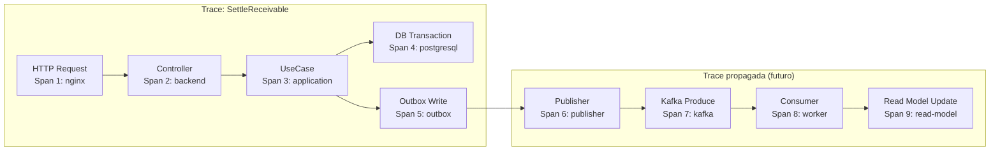

# Observabilidade em Escala

> Este documento descreve a observabilidade atual do sistema e o design evolutivo para suporte a ambientes de alto volume com tracing distribuído, logs estruturados e SLI/SLO. As seções de **proposta futura** descrevem designs ainda não implementados.

---

## Observabilidade Atual — O Que Está Implementado

### Saúde da aplicação

| Endpoint | Descrição |
|---|---|
| `GET /actuator/health` | Status geral com probes de liveness e readiness |
| `GET /actuator/health/liveness` | Probe de liveness — aplicação está viva? |
| `GET /actuator/health/readiness` | Probe de readiness — aplicação está pronta para receber tráfego? |
| `GET /actuator/metrics` | Lista todos os IDs de métricas disponíveis |
| `GET /actuator/prometheus` | Métricas no formato texto Prometheus (OpenMetrics) |

### Métricas de negócio implementadas

8 métricas registradas via `BusinessMetrics` (`infrastructure/observability/`), tag `application=srm-credit-engine`:

| Tipo | ID Micrometer | Nome Prometheus |
|---|---|---|
| Counter | `pricing.simulations.total` | `pricing_simulations_total` |
| Counter | `exchange.rates.registered.total` | `exchange_rates_registered_total` |
| Counter | `settlements.created.total` | `settlements_total` |
| Counter | `settlements.failed.total` | `settlements_failed_total` |
| Counter | `reports.settlement.queries.total` | `reports_settlement_queries_total` |
| Timer | `pricing.simulation.duration` | `pricing_simulation_duration_seconds` |
| Timer | `settlement.execution.duration` | `settlement_execution_duration_seconds` |
| Timer | `report.settlement.query.duration` | `report_settlement_query_duration_seconds` |

### Prometheus configurado

Scrape do backend a cada 15s via `infra/prometheus/prometheus.yml`. Prometheus disponível em `http://localhost:9090`.

### Limitação atual

A observabilidade atual cobre o **backend como processo único**. Em uma arquitetura com múltiplos workers, brokers e serviços, ela seria insuficiente para:
- Rastrear uma request de ponta a ponta entre componentes
- Detectar gargalos em filas de mensagens
- Correlacionar logs entre instâncias

---

## SLI/SLO Propostos

> Valores aprovados como referência inicial para ambiente de produção.

### SLI — Service Level Indicators

Métricas mensuráveis que definem o comportamento do serviço:

| SLI | Fórmula | Ferramenta |
|---|---|---|
| **Disponibilidade** | Requisições bem-sucedidas / Total de requisições | Prometheus |
| **Latência P99** | 99º percentil de `settlement_execution_duration_seconds` | Prometheus histogram |
| **Taxa de erro** | `settlements_failed_total` / (`settlements_total` + `settlements_failed_total`) | Prometheus |
| **Throughput** | `rate(settlements_total[1m])` | Prometheus |

### SLO — Service Level Objectives

| Aspecto | Objetivo |
|---|---|
| **Disponibilidade** | ≥ 99.9% (equivale a < 8,7h de downtime/ano) |
| **Latência P99 de liquidação** | < 500ms |
| **Taxa de erro de liquidação** | < 0.1% |
| **Lag de relatórios (com CQRS futuro)** | < 5s |

### PromQL para SLO de disponibilidade

```promql
# Taxa de sucesso de liquidações (últimos 30 dias)
1 - (
  rate(settlements_failed_total[30d])
  /
  (rate(settlements_total[30d]) + rate(settlements_failed_total[30d]))
)
```

### PromQL para SLO de latência

```promql
# P99 de latência de liquidação (últimos 5 minutos)
histogram_quantile(0.99,
  rate(settlement_execution_duration_seconds_bucket{application="srm-credit-engine"}[5m])
)
```

---

## Métricas Adicionais Futuras

> Proposta futura. Não implementadas.

### Métricas de fila e Outbox Publisher

| Métrica | Tipo | Descrição |
|---|---|---|
| `outbox.pending.count` | Gauge | Eventos na `outbox_events` com `status=PENDING` |
| `outbox.failed.count` | Gauge | Eventos com `status=FAILED` (DLQ) |
| `outbox.publish.duration` | Timer | Tempo de publicação de um evento no broker |
| `outbox.retry.count` | Counter | Número de retentativas de publicação |
| `kafka.consumer.lag` | Gauge | Diferença entre offset produzido e offset consumido por consumer group |
| `kafka.dlq.depth` | Gauge | Número de mensagens na Dead-Letter Queue |

### Métricas de worker (proposta futura)

| Métrica | Tipo | Descrição |
|---|---|---|
| `worker.settlement.processed.total` | Counter | Liquidações processadas por workers assíncronos |
| `worker.settlement.failed.total` | Counter | Falhas de processamento nos workers |
| `worker.settlement.duration` | Timer | Tempo de processamento por worker |
| `worker.projection.lag` | Gauge | Lag entre evento e atualização da projeção |

### Métricas de cache FX (proposta futura)

| Métrica | Tipo | Descrição |
|---|---|---|
| `fx.cache.hit.total` | Counter | Acertos de cache de taxa de câmbio |
| `fx.cache.miss.total` | Counter | Falhas de cache (acesso ao banco) |
| `fx.cache.hit.ratio` | Gauge | `hit / (hit + miss)` — eficiência do cache |

---

## Tracing Distribuído

> Proposta futura. Requer OpenTelemetry.

Em uma arquitetura com múltiplos componentes, um único request pode passar por:

```
Cliente HTTP → Nginx → Backend → PostgreSQL → Outbox Publisher → Kafka → Worker → Read Model
```

Sem tracing, é impossível saber onde uma operação ficou lenta ou onde falhou.

### OpenTelemetry — Design Proposto



**Cada span inclui:**
- `traceId` — ID único por request end-to-end
- `spanId` — ID único por componente/operação
- `parentSpanId` — referência ao span pai
- `startTime`, `duration`
- `status` (OK, ERROR)
- Atributos: `db.statement`, `http.method`, `http.status_code`, `receivableId`, `settlementId`

### Configuração OpenTelemetry no Spring Boot (proposta futura)

```yaml
# application.yaml
management:
  tracing:
    sampling:
      probability: 1.0   # 100% em dev; reduzir para 0.1 em prod
  otlp:
    tracing:
      endpoint: http://otel-collector:4318/v1/traces
```

---

## Logs Estruturados

> Proposta futura para produção. Atualmente, logs são em formato de texto padrão do Spring Boot.

Logs estruturados em JSON permitem filtragem e correlação por campos específicos.

### Formato proposto

```json
{
  "timestamp": "2026-06-22T14:00:00.123Z",
  "level": "INFO",
  "logger": "SettleReceivableUseCase",
  "message": "Settlement created",
  "traceId": "abc123def456",
  "spanId": "789xyz",
  "correlationId": "client-provided-uuid",
  "receivableId": "uuid-do-receivable",
  "settlementId": "uuid-do-settlement",
  "paymentCurrency": "USD",
  "settledAmount": "1523.47",
  "durationMs": 87
}
```

### Campos obrigatórios em logs financeiros

| Campo | Tipo | Descrição |
|---|---|---|
| `traceId` | String | Rastreamento end-to-end |
| `correlationId` | String | ID de correlação do cliente |
| `receivableId` | UUID | ID do recebível envolvido |
| `settlementId` | UUID | ID da liquidação (se criada) |
| `durationMs` | Integer | Duração da operação em ms |
| `level` | Enum | INFO, WARN, ERROR |

---

## Dashboards Propostos

> Proposta futura. Grafana não implementado nesta versão.

### Painel 1 — Negócio

| Visualização | Query |
|---|---|
| Liquidações por hora | `rate(settlements_total[1h]) * 3600` |
| Taxa de falhas | `rate(settlements_failed_total[5m]) / rate(settlements_total[5m])` |
| Simulações de precificação por minuto | `rate(pricing_simulations_total[1m]) * 60` |
| Taxas de câmbio registradas (últimas 24h) | `increase(exchange_rates_registered_total[24h])` |

### Painel 2 — Infraestrutura

| Visualização | Query |
|---|---|
| Latência P50/P99 de liquidação | `histogram_quantile(0.99, ...)` |
| Latência P99 de relatório | `histogram_quantile(0.99, rate(report_settlement_query_duration_seconds_bucket[5m]))` |
| Uso de CPU e memória da JVM | `jvm_memory_used_bytes`, `process_cpu_usage` |
| Conexões ativas no pool (HikariCP) | `hikaricp_connections_active` |

### Painel 3 — Filas (proposta futura)

| Visualização | Query |
|---|---|
| Lag do consumer Kafka | `kafka_consumer_lag` por consumer group |
| Profundidade da DLQ | `kafka_dlq_depth` |
| Eventos pendentes no Outbox | `outbox_pending_count` |
| Taxa de retry do publisher | `rate(outbox_retry_count[5m])` |

---

## Alertas Propostos

> Proposta futura. Alertas Prometheus não configurados nesta versão.

```yaml
# prometheus/alert-rules.yml (proposta futura)
groups:
  - name: srm-credit-engine-business
    rules:
      - alert: HighSettlementFailureRate
        expr: rate(settlements_failed_total[5m]) > 0.1
        for: 2m
        labels:
          severity: critical
        annotations:
          summary: "Taxa de falhas de liquidação acima de 0.1/min"

      - alert: SettlementLatencyHigh
        expr: histogram_quantile(0.99, rate(settlement_execution_duration_seconds_bucket[5m])) > 0.5
        for: 5m
        labels:
          severity: warning
        annotations:
          summary: "P99 de liquidação acima de 500ms"

      - alert: OutboxDLQNotEmpty
        expr: outbox_failed_count > 0
        for: 0m
        labels:
          severity: critical
        annotations:
          summary: "Eventos na DLQ do Outbox — intervenção necessária"

      - alert: KafkaConsumerLagHigh
        expr: kafka_consumer_lag > 10000
        for: 5m
        labels:
          severity: warning
        annotations:
          summary: "Consumer lag acima de 10.000 mensagens"
```

---

## Correlação por traceId e correlationId

| ID | Gerado por | Propagado via | Usado para |
|---|---|---|---|
| `traceId` | OpenTelemetry (automático) | HTTP headers W3C Trace Context (`traceparent`) | Rastreamento de uma request em todos os componentes |
| `correlationId` | Cliente HTTP (no request) ou gerado pelo backend | Header `X-Correlation-ID` + campo no `outbox_events` | Rastreamento de uma operação de negócio cross-sistema |
| `settlementId` | SettleReceivableUseCase | Resposta HTTP, logs, outbox payload | Identificação de um settlement específico |

**Fluxo de correlação:**

```
Cliente → POST /settlements
          Header: X-Correlation-ID: "client-op-uuid"
  → Backend recebe → gera traceId via OTel → loga {traceId, correlationId, receivableId}
  → OutboxEvent.correlation_id = correlationId
  → Publisher loga {traceId, correlationId, eventId}
  → Consumer recebe evento → extrai correlationId → loga {correlationId, settlementId}
```

Com isso, a busca por `correlationId: "client-op-uuid"` nos logs retorna todas as operações de todos os componentes relacionadas a esse request original.
