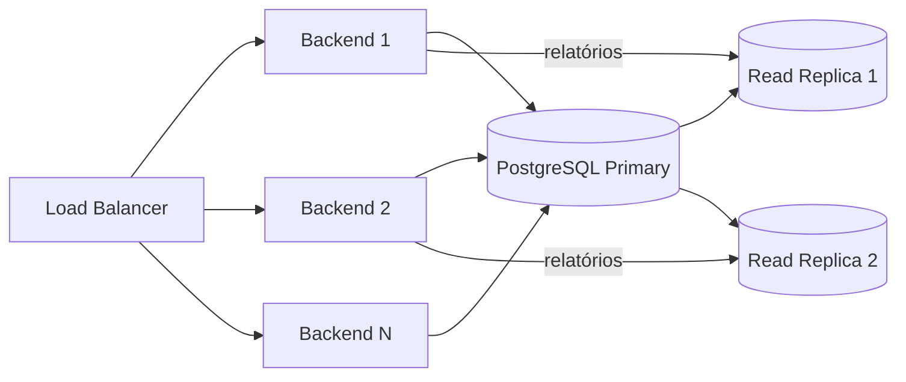
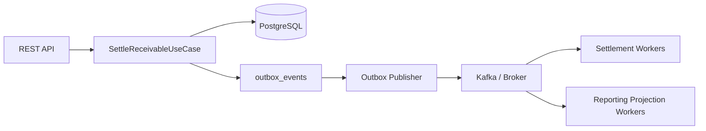
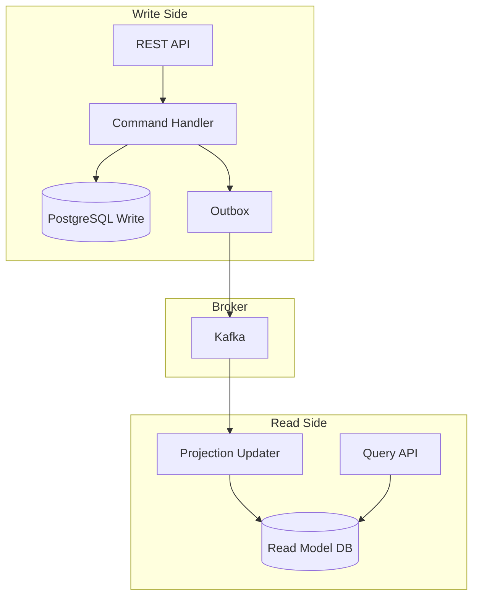

# Design de Escalabilidade — 1 Milhão de Transações por Minuto

> **Proposta futura — não implementado nesta versão.**
> Este documento descreve como o SRM Credit Engine evoluiria para suportar alto volume de transações. O sistema atual é um monólito modular síncrono que atende ao escopo do desafio. As estratégias aqui documentadas representam um **design evolutivo** para cenários de produção em larga escala.

---

## Objetivo do Design

Demonstrar como a arquitetura atual evoluiria de forma incremental para suportar:

- **1 milhão de transações por minuto** em pico de carga
- Processamento assíncrono com garantias de entrega
- Resiliência a falhas parciais sem perda de dados
- Observabilidade suficiente para operação em produção

---

## Premissas de Carga

| Parâmetro | Valor de referência |
|---|---|
| Volume sustentado | 500.000 transações/minuto |
| Pico de carga | 1.000.000 transações/minuto |
| Tamanho médio de payload por liquidação | ~2 KB |
| SLA de latência (liquidação síncrona) | P99 < 500ms |
| SLA de latência (liquidação assíncrona) | P99 < 30s até confirmação |
| Disponibilidade alvo | 99.9% (< 8,7h downtime/ano) |
| Taxa de erro aceitável | < 0.1% |
| Janela de processamento em lote | Off-peak (madrugada) para bulk |

---

## Gargalos do Desenho Atual

O sistema atual é **adequado para o escopo do desafio**, mas apresentaria os seguintes gargalos em produção de alto volume:

| Gargalo | Localização | Impacto |
|---|---|---|
| Banco de dados único | PostgreSQL single-node | Ponto único de falha e limitação de throughput de escrita |
| Processamento síncrono | `SettleReceivableUseCase` | Cada request aguarda a transação completa antes de responder |
| Relatórios no banco transacional | `SettlementReportService` | Queries analíticas competem com escritas pela mesma conexão |
| Sem cache de taxas de câmbio | `ExchangeRateLookupService` | Cada liquidação acessa o banco para buscar a taxa mais recente |
| Ingestão sequencial | Controller → UseCase | Sem fila de entrada, a capacidade está limitada ao throughput síncrono da API |
| Ausência de backpressure | Toda a stack | Sob carga extrema, a API aceitaria requests além de sua capacidade real |

---

## Estratégia de Escalabilidade Horizontal

### Fase 1 — Otimizações no Monólito (curto prazo)



**Ações:**
- Múltiplas instâncias do backend (stateless — sem estado local)
- Read replicas do PostgreSQL para relatórios e consultas
- Cache em memória (ou Redis) para taxas de câmbio
- Connection pooling (HikariCP com pool size calibrado)

### Fase 2 — Outbox Publisher + Broker (médio prazo)

> Proposta futura. Requer implementação do publisher assíncrono da `outbox_events`.



### Fase 3 — CQRS + Workers Assíncronos (longo prazo)

> Design evolutivo. Não implementado.



---

## Ingestão Assíncrona de Recebíveis

> Proposta futura.

Em vez de processar cada recebível de forma síncrona, a ingestão evoluiria para:

1. **API recebe o request** → valida campos básicos → persiste na fila de entrada → responde `202 Accepted` com `requestId`
2. **Worker de ingestão** consome a fila → executa a lógica completa → publica evento `ReceivableRegistered`
3. **Cliente consulta status** via `GET /receivables/{requestId}` ou recebe webhook

**Vantagem:** desacopla a capacidade de ingestão da capacidade de processamento. A API pode aceitar 1M req/min mesmo que o processamento seja feito em 500K req/min com workers em paralelo.

---

## Liquidação Assíncrona

> Proposta futura.

O fluxo de liquidação atual é síncrono: o cliente aguarda a resposta do `POST /settlements`. Em alto volume, isso não escala.

**Fluxo proposto:**

```
POST /settlements → 202 Accepted (settlementRequestId)
  → Worker de Liquidação consome fila
  → Executa SettleReceivableUseCase
  → Publica SettlementCompleted ou SettlementFailed
  → Cliente consulta GET /settlements/{id} ou recebe webhook
```

**Idempotência:** o `settlementRequestId` enviado pelo cliente garante que resubmissões não geram dupla liquidação.

---

## Particionamento

> Proposta futura.

Estratégias de particionamento para distribuir carga:

| Estratégia | Critério | Uso |
|---|---|---|
| Por cedente | `assignor_id` | Isola carga de um cedente de alto volume |
| Por moeda | `currency_id` | Filas separadas para BRL e USD |
| Por período de vencimento | `due_date` quarter | Batch processing por janela temporal |
| Por hash do receivable_id | `receivable_id % N` | Distribuição uniforme entre N workers |

No Kafka, isso se traduz em **partições do topic**, onde cada partition é consumida por um consumer dedicado, garantindo ordem dentro da partição e paralelismo entre partições.

---

## Cache de Taxas de Câmbio

> Proposta futura. Atualmente, cada liquidação acessa o banco.

**Estratégia proposta:**

```
Cache local (Caffeine) — TTL 60s, max 100 entradas
  ↓ miss
Cache distribuído (Redis) — TTL 5min, replicado entre instâncias
  ↓ miss
Banco de dados (PostgreSQL) — fonte da verdade
```

**Invalidação:** ao registrar nova taxa (`POST /exchange-rates`), o publisher envia evento `ExchangeRateRegistered` que invalida as entradas de cache relevantes.

**Risco:** taxa stale entre o TTL e a invalidação. Aceitável para taxas de câmbio com granularidade de minutos. Para alta precisão, reduzir TTL ou usar invalidação proativa.

---

## Read Replicas para Relatórios

> Proposta futura. Atualmente, relatórios acessam o banco primário.

**Topologia proposta:**

```
PostgreSQL Primary  (escritas, settlements, outbox)
      ↓ streaming replication
PostgreSQL Replica 1  (relatórios analíticos — SettlementReportService)
PostgreSQL Replica 2  (queries de auditoria, dashboards)
```

A camada `reporting` do projeto já é separada (`NamedParameterJdbcTemplate`) — isso é a semente do CQRS e facilita a troca da fonte de dados de leitura sem alterar a lógica de negócio.

---

## Bulk Processing

> Proposta futura.

Para cenários de processamento em lote (ex: liquidação de 500K recebíveis de uma única cedente no fechamento do mês):

- **Ingestão em lote:** endpoint `POST /settlements/batch` aceita array de comandos
- **Processamento com checkpoint:** cada lote é dividido em chunks de 1.000 registros; checkpoint por chunk garante retomada em caso de falha
- **Isolamento de recursos:** workers de bulk em pool separado, para não competir com requests interativos
- **Monitoramento:** métricas de progresso do lote (`batch.progress`, `batch.failed.chunks`)

---

## Controle de Backpressure

> Proposta futura.

Sem backpressure, uma API sobrecarregada aceita requests que nunca conseguirá processar — causando timeout em cascata.

**Estratégias:**

| Mecanismo | Implementação |
|---|---|
| Rate limiting | Nginx ou API Gateway com token bucket por IP/cliente |
| Circuit Breaker | Resilience4j (planejado, não implementado) — abre circuito após N falhas consecutivas |
| Queue depth check | Se fila de entrada > threshold, responder `503 Service Unavailable` com `Retry-After` |
| Bulkhead | Workers segregados por tipo de operação (não misturar relatório com liquidação) |

---

## Estratégia de Degradação Graceful

| Cenário | Comportamento esperado |
|---|---|
| Banco de escrita indisponível | Aceitar ingestão na fila; pausar processamento; alertar |
| Read replica indisponível | Redirecionar relatórios ao primário (degradado, não parado) |
| Broker indisponível | Acumular na `outbox_events`; publicar ao reconectar |
| Worker travado | Timeout + dead-letter queue; alertar; outro worker assume |
| API sobrecarregada | Rate limit + `503` com `Retry-After`; não aceitar mais requests |

---

## Riscos

| Risco | Probabilidade | Impacto | Mitigação |
|---|---|---|---|
| Consistência eventual entre write e read side | Alta | Médio | Aceitar lag definido (SLO de consistência); expor `X-Data-Age` nos relatórios |
| Dupla liquidação em cenário de retry | Média | Crítico | Idempotency key obrigatória; UNIQUE no banco como última barreira |
| Aumento de complexidade operacional | Alta | Alto | Evolução incremental; não migrar tudo de uma vez |
| Custo de infraestrutura | Média | Alto | Autoscaling com scale-to-zero fora de horário de pico |
| Debug mais difícil com async | Alta | Médio | Tracing distribuído obrigatório (OpenTelemetry) |

---

## Roadmap Incremental

| Fase | O que fazer | Pré-requisito |
|---|---|---|
| **Fase 1** | Cache de FX + Read Replica para relatórios | Apenas configuração |
| **Fase 2** | Implementar Outbox Publisher + Kafka | `outbox_events` já existe no schema |
| **Fase 3** | Workers de liquidação assíncrona + idempotency key | Kafka em produção |
| **Fase 4** | CQRS completo com read model dedicado + Projections | Workers funcionando e estáveis |

> Cada fase é independente e entregável. Não é necessário completar a Fase 4 para se beneficiar da Fase 1.
